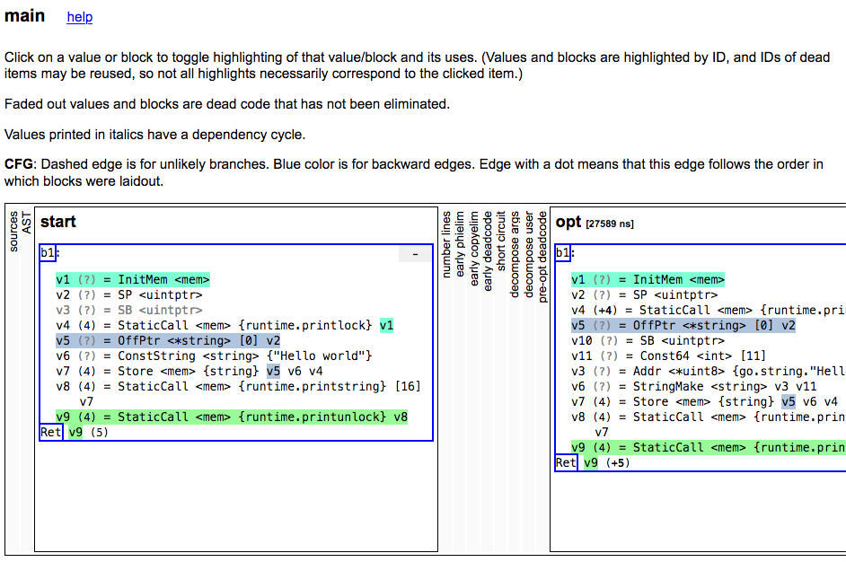

# GOSSAFUNC

`go build` "accepts" `GOSSAFUNC` env variable which can designate a name of the
function to show compiler optimization steps for.

It will generate a `ssa.html` file with the following format (compiled with `go1.14.2`):

